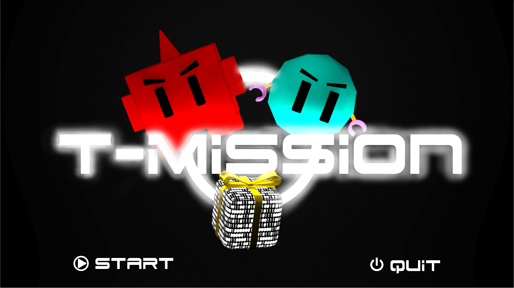
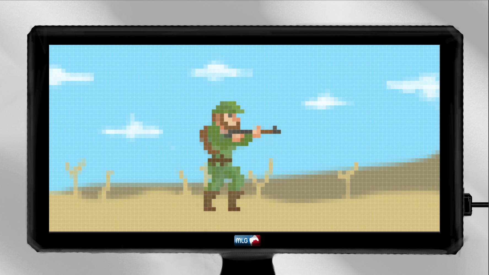
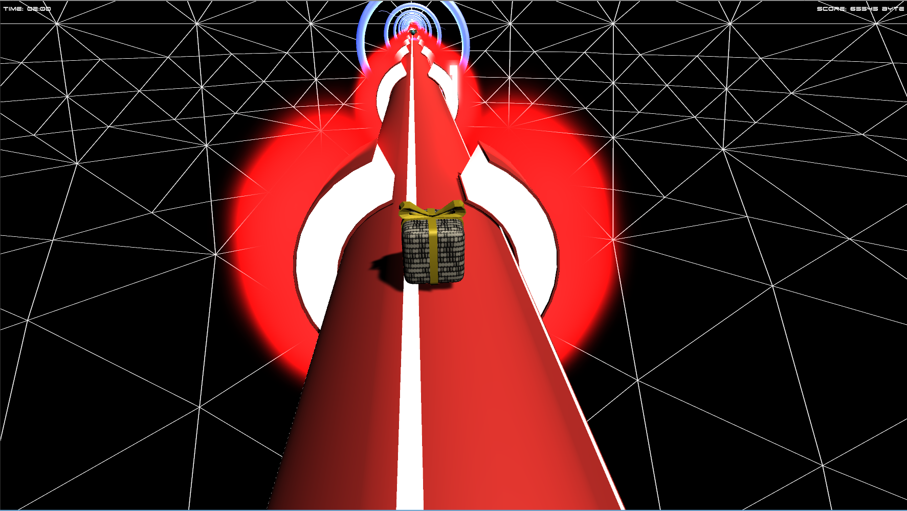
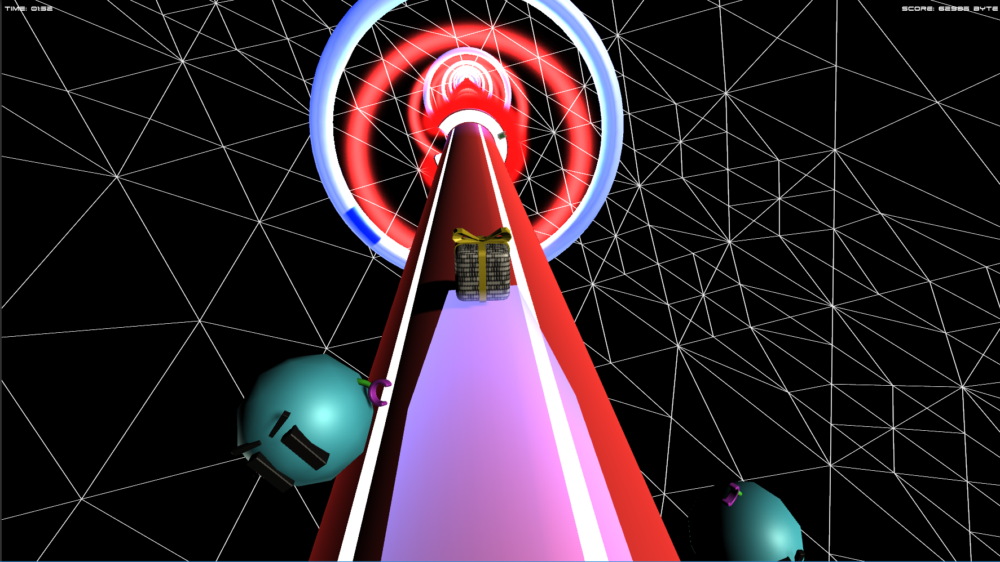

# T-Mission
T-Mission è stato sviluppato durante la Global Game Jam al Politecnico di Milano; è un gioco in cui bisogna guidare un pacchetto di dati attraverso i pericoli del web. Il giocatore può spostare il pacchetto attorno al cavo di connessione per evitare ostacoli (come congestione dei dati, virus e firewall) che lo rallentano, in modo da raggiungere l'altra estremità della connessione senza ritardi. Ogni volta che il pacchetto colpisce un ostacolo, alcuni dati vengono persi. Se il giocatore perde tutti i dati o non arriva alla fine del livello prima che scada il tempo, il gioco è finito.
È stato totalmente sviluppato con Unity.

Link Global Game Jam: https://globalgamejam.org/2018/games/t-mission-0
